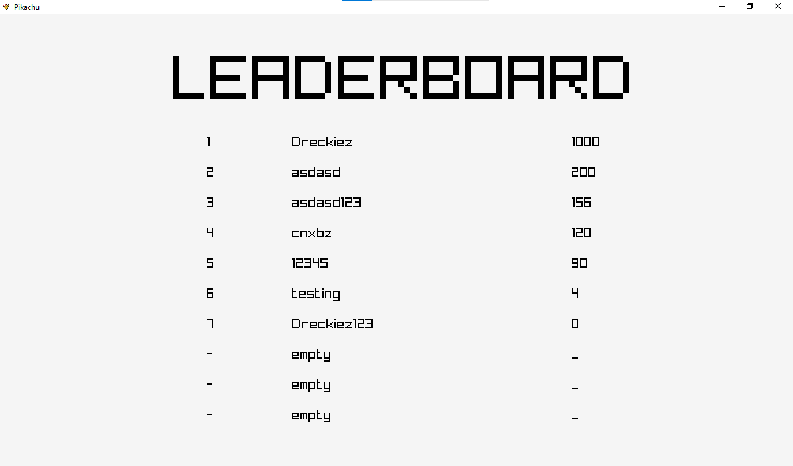

# Pokemon Matching Game :shipit:
This is a mini project for my **Programming Techniques** subject. The project’s purpose was to test my understandings and knowledge about **2D pointer** and **Linked List** as well as my programming skills.

This project was created based on the [Raylib](https://www.raylib.com/) library. I chose it because it seems like a modern and easy-to-use library for videogames programming with many handy functions for visualization.
>"raylib is a programming library to enjoy videogames programming; no fancy interface, no visual helpers, no gui tools or editors... just coding in pure spartan-programmers way."\
>-From Raylib website-

## About the game
The game starts with a board filled with squares containing different letters. Your task is to remove all pairs of matching letters by selecting them. A pair of letters is considered matching if they can
be connected by a straight line that makes no more than two turns.\
You can select letters by using the arrow keys and the Enter key to choose the desired squares. If they form a matching pair, they will disappear, and you will earn some points. If they do not match, you will lose the same points if they were match.\
Noted that select a blank character won’t do anything.

## Screenshots and Demo Video

[Demo Video](https://www.youtube.com/watch?v=tCnd2iCCf2M)
